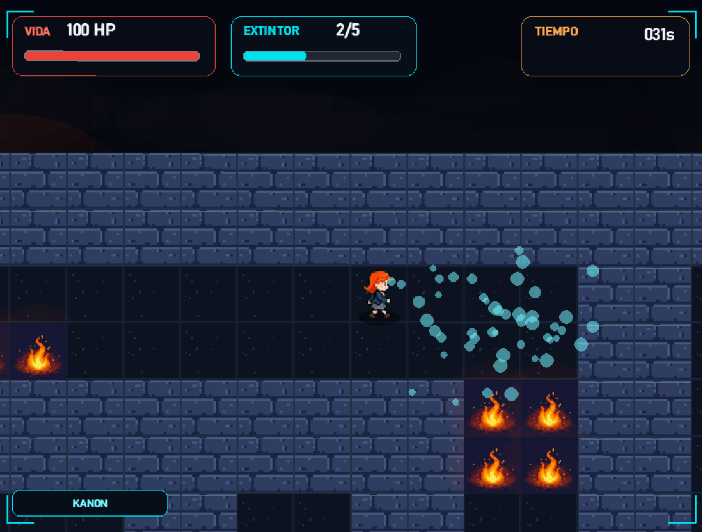
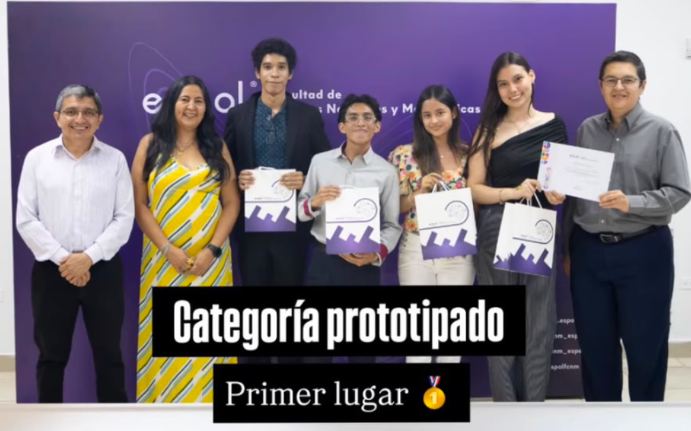
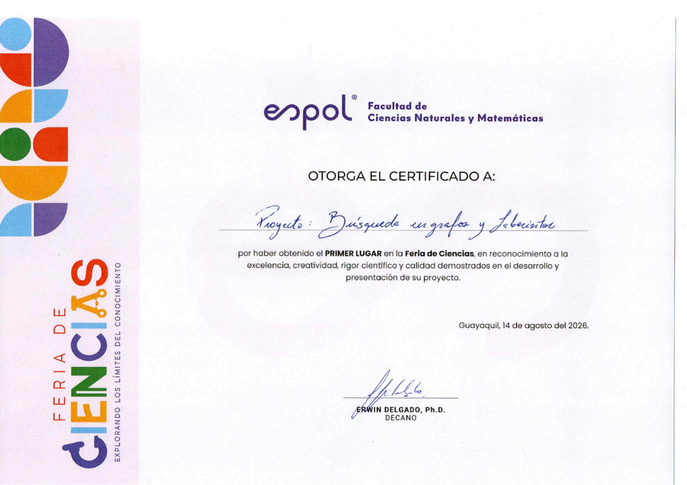

<div align="center">
  <h1>Código de Escape</h1>
  <p><em>Búsquedas en Grafos y Laberintos</em></p>
  
  
</div>

<br>

## 🎮 Acerca del juego

"Código de Escape" es un juego de supervivencia en 2D donde debes escapar de un laberinto en llamas. Iniciando siempre desde una posición fija en la esquina superior izquierda, tu objetivo es navegar por pasillos generados procedimentalmente y alcanzar el portal de salida antes de que el cronómetro avance demasiado o el fuego consuma tus puntos de vida. Durante la partida, deberás usar un extintor de cargas limitadas para abrirte paso, esquivar escombros y sobrevivir a terremotos inesperados.

## ⚙️ Características destacadas del código

* **Generación Procedural mediante Grafos (DFS):** El diseño del mapa no es estático ni predefinido. Se construye en tiempo real utilizando el algoritmo de Búsqueda en Profundidad (Depth-First Search), garantizando que el laberinto sea perfecto, transitable y sin ciclos cerrados.
* **Cálculo de Ruta Óptima (BFS):** Para maximizar el desafío del jugador, el programa implementa el algoritmo de Búsqueda en Anchura (Breadth-First Search). Este algoritmo escanea el grafo completo para encontrar el nodo más lejano posible desde el punto de inicio y coloca el portal de salida exactamente en esa coordenada.
* **Sistema Dinámico de Propagación de Fuego:** El incendio actúa como un autómata celular basado en turnos. El fuego calcula las celdas adyacentes y se expande de manera orgánica basándose en probabilidades estadísticas (RNG) a medida que el jugador se mueve.
* **Cámara y Partículas Independientes:** Incluye una cámara que rastrea al jugador y aplica desplazamientos matemáticos aleatorios para simular terremotos de forma realista, además de un gestor de partículas independientes con canal Alpha para simular el humo y la espuma del extintor.

## 📁 Estructura del Proyecto

El repositorio está organizado de la siguiente manera para facilitar el mantenimiento:

```text
codigo-de-escape/
│
├── main.py              # Bucle principal del juego y lógica central
├── config.py            # Constantes de resolución, colores y tamaño de celda
│
├── src/
│   ├── core/            # Lógica del jugador, validación de coordenadas y cronómetro
│   ├── graficos/        # Sistema de cámara, renderizado del entorno y menús
│   ├── mapa/            # Algoritmos de grafos (DFS/BFS), fuego y trampas
│   └── sistema/         # Entradas del teclado, selección de personajes y audio
│
└── assets/              # Recursos multimedia
    ├── interfaz/        # Elementos visuales y logos de las instituciones
    ├── sonidos/         # Pistas de audio y efectos de sonido
    └── sprites/         # Texturas del mapa y hojas de animación de personajes
```

## 📸 Imágenes del juego

<div align="center">
  
  
  <br>
  <em>Izquierda: Visualizando la pantalla de inicio del juego. <br> Derecha: Mapa del laberinto y obstáculos.</em>
</div>

## 🥇 Primer Lugar - Feria de Ciencias ESPOL 2026

<div align="center">
  
  
  <br>
  <em>Este proyecto fue galardonado con el Primer Lugar en la Feria de Ciencias 2026 de la Escuela Superior Politécnica del Litoral (ESPOL). El programa destacó por la aplicación práctica de algoritmos de teoría de grafos y estructuras de datos discretas en un entorno interactivo. Este logro es el resultado de la experimentación y el esfuerzo conjunto de los cuatro miembros de nuestro grupo de investigación.</em>
</div>

## 👥 Equipo de Desarrollo

Este prototipo fue construido colaborativamente por:

- **Santiago Gómez** (SRGM-sys)
- **Matías Sánchez** (TheMattias1127)
- **Karen Trujillo** (karentat-c)
- **Britta Wozniak** 
